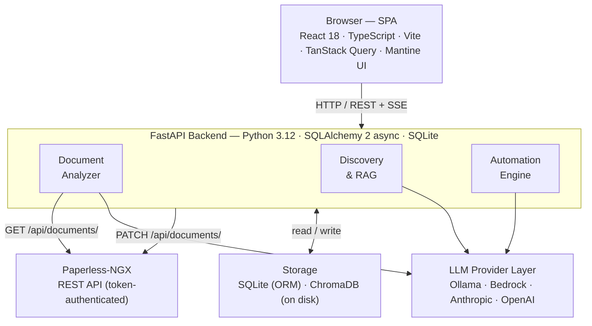

# Paperless IQ

**Open-source AI layer for [Paperless-NGX](https://docs.paperless-ngx.com/).** Paperless IQ connects to your existing paperless-ngx instance and adds LLM-driven automatic metadata tagging, a RAG-powered conversational document search, and a background automation engine — all self-hosted, all with a human-in-the-loop approval workflow.

Works with local models via **Ollama**, **Amazon Bedrock** (Claude, Nova, Llama, Mistral, Titan), **Anthropic**, and **OpenAI**.

---

## Features

### AI Metadata Analysis
- **Automatic metadata suggestions** — document OCR text or full content is sent to an LLM which returns structured metadata: title, tags, correspondent, document type, storage path, and custom fields
- **Smart entity selection** — ChromaDB vector similarity finds similar previously-processed documents and sends only the relevant subset of tags / correspondents / types to the LLM, reducing prompt size and improving accuracy
- **Per-field instructions** — tell the LLM exactly how to populate each metadata field (e.g. "always use the full legal name for correspondent")
- **Per-document-type prompt overrides** — different prompt templates for invoices vs. contracts vs. letters
- **New value detection** — suggested values that don't exist in Paperless-NGX are highlighted; creation policies control whether they can be created on approval
- **Analysis modes** — `ocr` (fast, just OCR text) or `full_document` (sends full extracted content)
- **Context window control** — configurable character limit caps what gets sent to the LLM

### Approval Workflow
- **Approval queue** — every suggestion is staged for review before anything is written to Paperless-NGX
- **Editable suggestions** — edit title, tags, correspondent, document type, storage path, and custom fields inline before approving
- **Keep existing tags** — merge suggested tags with a document's current tags instead of replacing them
- **Batch actions** — approve or reject multiple suggestions at once
- **Auto-apply mode** — opt-in bypass of the approval queue for fully automated pipelines

### Discovery — Conversational Document Search
- **RAG-powered chat** — ask natural language questions about your document archive; answers are grounded in your actual documents with inline source citations
- **Multi-turn conversations** — follow-up questions work correctly; the model maintains context across turns using a server-side session with a sliding window of recent exchanges
- **Automatic summarisation** — when a conversation grows long, older turns are compressed into a rolling prose summary so the context window stays bounded without losing history
- **Query reformulation** — follow-up questions ("when does the first one expire?") are rewritten into standalone search queries before hitting the vector store, so retrieval stays accurate throughout the conversation
- **Long-term memory** — at the end of each conversation, key facts are extracted by the LLM ("Telekom contract ends 2025-08, €30/month") and stored as individual memory entries; similar facts are deduplicated via cosine similarity rather than accumulating duplicates
- **Memory injection** — relevant memories are semantically retrieved and injected into the system prompt of every new conversation so the model has prior context from day one
- **Memory management** — Settings → Memories tab lists every stored fact with inline edit and delete; a global toggle enables/disables the feature

### Automation
- **Inbox monitoring** — polls a configurable Paperless-NGX inbox tag for new documents and processes them automatically
- **Scheduled batch runs** — cron-based batch processing of unanalysed documents
- **Configurable concurrency** — batch size, poll interval, and per-provider embedding concurrency are all tunable

### Manual Analysis
- **On-demand analysis** — trigger analysis for any document in your archive with optional per-run overrides for provider, model, and analysis mode
- **Bulk analysis** — select and queue multiple documents at once
- **Tag filter** — narrow the document list by tag before selecting

### Audit Log
- **Field-level change history** — every metadata write is recorded with old value, new value, change source (manual vs. auto), and linked suggestion
- **Configurable retention** — audit entries are automatically pruned after a configurable number of days (minimum 90)

### Settings
Settings are organised into eight tabs:

| Tab | Contents |
|-----|----------|
| **Connection** | Paperless-NGX public URL, connection test, inbox tag, webhook registration |
| **AI Provider** | LLM provider + model + credentials, context window, analysis mode, embedding provider, vector store backend |
| **Prompts & Fields** | Global system prompt, LLM output language, per-field instructions, custom fields |
| **Metadata Rules** | Smart entity selection toggle, similar-docs count, frequency fallback, entity creation policies |
| **Automation** | Enable/disable, auto-apply, poll interval, batch size, cron schedule, creation policies |
| **Appearance** | Theme colours, typography, logo, nav icons, UI language, colour scheme (light/dark/auto) |
| **Memories** | Enable/disable long-term memory, list/edit/delete individual facts, clear all |
| **Access Control** | Per-user permission flags, NG admin sync toggle, maintenance actions (reindex, reset tracking) |

### LLM Providers
| Provider | Completions | Embeddings |
|----------|-------------|------------|
| **Ollama** (local) | ✓ | ✓ |
| **Amazon Bedrock** | ✓ (all model families via Converse API — Claude, Nova, Llama, Mistral) | ✓ (Titan v1/v2, Cohere) |
| **Anthropic** | ✓ | — |
| **OpenAI** | ✓ | ✓ (text-embedding-3-small) |

All provider health checks are credential-only — no live API calls are made during status polling.

### UI & UX
- **Responsive mobile layout** — sidebar slides in from the left as a drawer on small screens; a backdrop overlay and auto-close on navigation
- **Full theme customisation** — primary colour, sidebar gradient, body/card/chip colours, font family and size, custom logo, per-page nav icons
- **Dark/light sidebar detection** — WCAG-based contrast calculation ensures text and chip colours are always legible regardless of chosen palette
- **Authentication & access control** — HMAC-signed session tokens; login validated against Paperless-NGX; per-user permission flags (view queue, approve, analyze, discover, settings); Paperless-NGX admins optionally auto-granted full access; can be disabled for single-user setups
- **Internationalisation** — UI language switchable (English, German, French, Spanish, Italian); LLM output language independently configurable

---

## Requirements

- A running [Paperless-NGX](https://docs.paperless-ngx.com/) instance (any recent version)
- Docker (for the recommended deployment path)
- An LLM provider: a local [Ollama](https://ollama.com/) instance, or API credentials for Anthropic, OpenAI, or Amazon Bedrock

---

## Quick Start

Add to your Paperless-NGX `docker-compose.yml`:

```yaml
  paperless-iq:
    build:
      context: /path/to/paperless-iq
      dockerfile: docker/Dockerfile
    restart: unless-stopped
    depends_on:
      - webserver
    ports:
      - "8082:8080"
    volumes:
      - paperless-iq-data:/data
    environment:
      PAPERLESS_URL: http://webserver:8000
      PAPERLESS_TOKEN: <your-paperless-api-token>
      SECRET_KEY: <random-secret-for-encryption>
      # Optional: pre-configure LLM on first run
      PIQ_LLM_PROVIDER: bedrock
      PIQ_LLM_MODEL: eu.anthropic.claude-haiku-4-5-20251001-v1:0
```

Add to the `volumes:` section:

```yaml
volumes:
  paperless-iq-data:
```

Then:

```bash
docker compose up -d --build paperless-iq
```

Access the UI at `http://localhost:8082`.

---

## Configuration

All settings are configurable via the web UI. On first startup, settings can be seeded from environment variables (prefixed `PIQ_`). After the first UI save, database values take precedence over environment variables.

### Required Environment Variables

| Variable | Purpose |
|----------|---------|
| `PAPERLESS_URL` | Base URL of the Paperless-NGX instance (internal, e.g. `http://webserver:8000`) |
| `PAPERLESS_TOKEN` | API token for Paperless-NGX |
| `SECRET_KEY` | Master key for Fernet encryption of credentials stored at rest |

### Security Environment Variables

| Variable | Default | Purpose |
|----------|---------|---------|
| `CORS_ALLOWED_ORIGINS` | `*` | Comma-separated list of allowed CORS origins. Restrict this in production (e.g. `https://paperless.example.com`). |

> **Webhook secret** — Paperless IQ auto-generates a webhook secret on first startup and embeds it in the callback URL registered with Paperless-NGX. No manual configuration is required.

### Optional Environment Variables (`PIQ_*` — initial seed only)

| Variable | Default | Purpose |
|----------|---------|---------|
| `PIQ_LLM_PROVIDER` | `ollama` | `ollama` · `anthropic` · `openai` · `bedrock` |
| `PIQ_LLM_MODEL` | `llama3` | Model name (provider-specific) |
| `PIQ_LLM_CREDENTIALS` | — | API key (Anthropic/OpenAI) or JSON credentials (Bedrock) |
| `PIQ_OLLAMA_URL` | `http://localhost:11434` | Ollama server URL |
| `PIQ_EMBED_PROVIDER` | `ollama` | Embedding provider: `ollama` · `openai` · `bedrock` |
| `PIQ_EMBEDDING_MODEL` | `nomic-embed-text` | Embedding model name |
| `PIQ_DEFAULT_ANALYSIS_MODE` | `ocr` | `ocr` or `full_document` |
| `PIQ_CONTEXT_WINDOW_CHARS` | `128000` | Max characters sent to LLM per request |
| `PIQ_SMART_ENTITY_SELECTION` | `true` | Use vector similarity for entity pre-selection |
| `PIQ_SIMILAR_DOCS_COUNT` | `10` | Similar documents to retrieve for entity selection |
| `PIQ_FREQUENCY_FALLBACK_COUNT` | `20` | Top-N frequent entities used as fallback |
| `PIQ_TAG_CREATION_POLICY` | `existing_only` | `existing_only` or `allow_new` |
| `PIQ_CORRESPONDENT_CREATION_POLICY` | `existing_only` | `existing_only` or `allow_new` |
| `PIQ_DOCTYPE_CREATION_POLICY` | `existing_only` | `existing_only` or `allow_new` |
| `PIQ_INBOX_TAG_ID` | — | Paperless-NGX tag ID for the inbox |
| `PIQ_AUTO_APPLY` | `false` | Skip the approval queue |
| `PIQ_AUTOMATION_ENABLED` | `false` | Enable inbox polling and scheduled runs |
| `PIQ_POLL_INTERVAL_SECONDS` | `10` | Inbox poll interval |
| `PIQ_BATCH_SIZE` | `10` | Documents per scheduled batch |
| `PIQ_SCHEDULE_CRON` | — | Cron expression for batch runs |
| `PIQ_AUDIT_RETENTION_DAYS` | `90` | Days before audit entries are pruned |
| `PIQ_TARGET_LANGUAGE` | — | Language for LLM responses (e.g. `German`) |
| `PIQ_VECTOR_STORE_BACKEND` | `local` | `local` (ChromaDB) or `bedrock_kb` |
| `PIQ_BEDROCK_KB_ID` | — | Bedrock Knowledge Base ID |
| `PIQ_MEMORY_ENABLED` | `true` | Enable long-term memory extraction |

---

## Architecture



### Key data flows

**Metadata analysis**
1. Inbox monitor detects new document → queues for analysis
2. Analyzer fetches OCR text from Paperless-NGX
3. Smart entity selection queries ChromaDB for similar documents, pre-filters the entity lists
4. Prompt is assembled and sent to the configured LLM provider
5. LLM returns structured JSON → parsed into a `MetadataSuggestion`
6. Suggestion stored in SQLite and shown in the approval queue
7. On approval → writes metadata back to Paperless-NGX via API → audit log entry

**Discovery conversation**
1. User sends a question → backend creates or resumes a `ConversationSession`
2. If there is conversation history, the question is reformulated as a standalone search query
3. Relevant long-term memories are retrieved from the ChromaDB `piq_memories` collection and injected into the system prompt
4. ChromaDB `paperless_iq_chunks` collection is queried for relevant document passages
5. LLM is called with: system message (instructions + memories + prior summary) + recent conversation turns + fresh document context
6. Answer is returned with source citations
7. New Q&A pair is appended to the session; if the window exceeds 8 turns, older turns are compressed into a rolling summary
8. On session close → LLM extracts memorable facts → deduplicated against existing memories → stored in `user_memories` table + `piq_memories` Chroma collection

---

## Development

```bash
# Install dependencies
uv sync

# Run tests
uv run pytest

# Run dev server (not for Docker use)
uv run uvicorn backend.main:app --reload

# Database migrations
uv run alembic upgrade head
```

### Rebuilding the Docker image after code changes

```bash
docker compose build paperless-iq && docker compose up -d paperless-iq
```

---

## License

[PolyForm Noncommercial License 1.0.0](LICENSE) — free for personal, research, educational, and non-commercial use. Commercial use requires a separate agreement. Contributions are welcome via pull request and are accepted under the same license terms.
