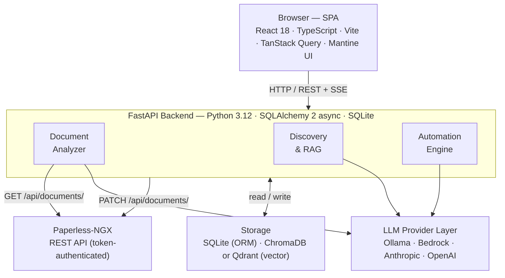

# Paperless IQ

**Add LLM intelligence to your [Paperless-NGX](https://docs.paperless-ngx.com/) — self-hosted, privacy-first, and built for non-English archives.**

Paperless IQ connects to your existing Paperless-NGX instance and gives it a brain: an LLM reads every document, suggests structured metadata, and lets you have natural conversations with your entire archive. No cloud dependency, no data leaving your server.

---

## How Paperless IQ compares to Paperless-NGX v3

Paperless-NGX v3.0 (currently in beta) ships its own LLM integration: metadata suggestions for titles, tags, correspondents, and document types, plus a document chat feature backed by FAISS vector search. That's a meaningful step forward from the old rule-based classifier.

Paperless IQ goes deeper on every dimension — more providers, more control, stronger retrieval, and features that Paperless-NGX v3 simply doesn't have.

| | Paperless-NGX v3.0 (beta) | Paperless IQ |
|---|---|---|
| **LLM metadata suggestions** | Titles, dates, tags, correspondents, doc types | All of those + **custom fields** |
| **LLM providers** | OpenAI-compatible APIs · Ollama | Ollama · Anthropic · OpenAI · **Amazon Bedrock** (Claude, Nova, Llama, Mistral) |
| **Approval workflow** | Inline suggestions | Full queue — editable fields, suggestion stacking, batch approve/reject |
| **Scanned / image-only PDFs** | Azure AI cloud OCR | **On-premise vision analysis** — LLM renders and reads pages directly |
| **Document chat / RAG** | Yes, via FAISS ("hit-or-miss" per community) | ChromaDB · **Qdrant with hybrid dense+sparse search** · Bedrock KB |
| **Long-term memory** | — | Facts extracted at session end, injected into future sessions |
| **Per-field prompt control** | — | Per-field instructions + per-document-type prompt templates |
| **Non-English metadata output** | — | Configurable output language, independent of UI language |
| **Multilingual search quality** | — | **bge-reranker-v2-m3** cross-encoder covers 100+ languages |
| **Re-ranking** | — | LLM · local cross-encoder · Amazon Bedrock Rerank |
| **Search tuning** | — | Chunk size/overlap · HNSW parameters · overfetch · min-score |
| **Audit log** | — | Field-level history with configurable retention |
| **Runs fully air-gapped** | Yes (with Ollama) | Yes — Ollama + local ChromaDB/Qdrant, no outbound calls |

---

## Feature Highlights

### Full Document Analysis — understands what you have

Every document is sent to the LLM with its OCR text. The LLM returns structured JSON: title, tags, correspondent, document type, storage path, and any custom fields. Suggestions land in an approval queue so nothing touches your archive without your sign-off.

**Smart entity selection** keeps prompts tight and accuracy high: instead of listing all 500 of your tags, ChromaDB or Qdrant finds the 10–20 documents most similar to the one being analysed, and only the entities that appear on those documents go into the prompt. The LLM picks from a focused, relevant shortlist — not a phone book.

**Per-field instructions** let you teach the LLM your conventions: "always use the full legal company name for correspondent", "storage path format: `invoices/YYYY/MM`". Per-document-type prompt overrides handle invoices differently from contracts, letters differently from receipts.

### Vision Analysis — for scans that OCR can't handle

For image-only PDFs and scans where Tesseract produces poor or empty text, Paperless IQ can render each page as an image and send it to a vision-capable LLM. Analysis happens in two phases:

1. **Transcription** — the vision LLM reads the rendered pages and produces clean text
2. **Metadata analysis** — that text feeds the standard analysis pipeline, including smart entity selection

DPI and batch size (pages per LLM call) are tunable. Works with any vision-capable model: Ollama multimodal models, Claude 3/4 via Anthropic or Bedrock, GPT-4o via OpenAI.

### Built for Multilingual Archives

Non-English documents are a first-class use case, not an afterthought:

- **LLM output language** is independently configurable — analyse German invoices and have the suggested title come back in German, or in English, regardless of the document's language
- **Per-field instructions** can encode language-specific conventions (e.g. "correspondent name should use the German legal form")
- **Multilingual reranker** — the optional cross-encoder reranker defaults to `BAAI/bge-reranker-v2-m3`, a model explicitly trained across 100+ languages, so Discovery search quality doesn't degrade for non-English document collections
- **UI available in English, German, French, Spanish, and Italian** — switch language independently of the LLM output language

### Discovery — conversational search with long-term memory

Ask questions about your document archive in natural language and get answers grounded in your actual documents, with inline source citations.

Discovery is more than a search box:

- **Multi-turn conversations** with query reformulation — follow-ups like "when does that one expire?" are rewritten into standalone search queries before hitting the vector store
- **Automatic conversation compression** — sessions are unlimited; older turns are summarised into a rolling prose summary so the context window stays bounded
- **Long-term memory** — when you close a session, the LLM extracts memorable facts ("Telekom contract ends 2025-08, €30/month") and stores them. Duplicate facts are deduplicated by cosine similarity, not accumulated. The next session starts with those facts already in context.
- **Memory management** — Settings → Memories lists every stored fact with inline edit and delete

### Qdrant — production-grade vector search

Beyond the built-in ChromaDB store, Paperless IQ supports Qdrant as a drop-in replacement — locally via Docker or cloud-hosted.

With Qdrant you get:

- **Hybrid search** — combines dense semantic vectors with sparse BM25 keyword vectors via Reciprocal Rank Fusion; better recall on exact terms (invoice numbers, names, dates) without sacrificing semantic quality
- **HNSW tuning** — `ef`, `M`, and `construction_ef` are all configurable, so you can trade index size and build time for query-time accuracy
- **Scalar and binary quantisation** — reduce memory footprint for large archives
- **Seamless migration** — switching backends migrates your existing embeddings without re-embedding anything

### Library — Entity Grooming

The Library page gives administrators tools to keep the entity space clean and the LLM context tight. It is gated behind the `can_groom` permission flag.

- **Entity descriptions** — write or auto-generate LLM descriptions for every tag, correspondent, and document type. These descriptions are injected into the smart entity selection prompt so the LLM can distinguish between similarly-named entities and make better-informed picks from the shortlist.
- **Deduplication** — detects near-duplicate entities using a combination of fuzzy name matching and embedding cosine similarity (both thresholds configurable). One click merges duplicates in Paperless-NGX, consolidating all document assignments automatically.
- **Mismatch scan** — re-analyses already-approved documents against the current entity set and flags ones where the LLM would now suggest different tags, correspondents, or document types. Useful after bulk merges or entity renames to catch stale assignments.
- **Scheduled scans** — mismatch scans run automatically on a configurable cron schedule; on-demand scan also available.

### Four LLM Providers, Zero Lock-in

Run entirely on your own hardware, or use any major cloud provider:

| Provider | Completions | Embeddings |
|----------|-------------|------------|
| **Ollama** (local) | ✓ | ✓ |
| **Amazon Bedrock** | ✓ (all families via Converse API — Claude, Nova, Llama, Mistral) | ✓ (Titan v1/v2, Cohere) |
| **Anthropic** | ✓ | — |
| **OpenAI** | ✓ | ✓ (text-embedding-3-small) |

Switch providers live without losing your index — embeddings migrate automatically. Provider credentials are Fernet-encrypted at rest.

### Fine-tunable to Your Archive

Most tools give you one knob. Paperless IQ gives you a control panel:

- **Chunk size and overlap** — configurable text chunking for indexing and retrieval
- **Overfetch + min-score** — retrieve more candidates than you need, then filter by minimum similarity score
- **Re-ranking** — optionally re-score the top-K retrieved chunks with a cross-encoder: `llm` (uses your configured LLM), `local` (bge-reranker-v2-m3 runs on-device), or `api` (Amazon Bedrock Rerank)
- **Context window cap** — limit how many characters the LLM sees per request
- **Embedding concurrency** — control how many parallel embedding requests the backend sends
- **LLM timeout** — prevent runaway requests from blocking the queue

---

## Features

### AI Metadata Analysis
- **Automatic metadata suggestions** — document OCR text or vision-transcribed content is sent to an LLM which returns structured metadata: title, tags, correspondent, document type, storage path, and custom fields
- **Smart entity selection** — vector similarity finds similar previously-processed documents and sends only the relevant subset of tags / correspondents / types to the LLM, reducing prompt size and improving accuracy
- **Per-field instructions** — tell the LLM exactly how to populate each metadata field
- **Per-document-type prompt overrides** — different prompt templates for invoices vs. contracts vs. letters
- **New value detection** — suggested values that don't exist in Paperless-NGX are highlighted; creation policies control whether they can be created on approval
- **Context window control** — configurable character limit caps what gets sent to the LLM

### Vision Analysis
- **On-demand vision analysis** — renders document pages as images and sends them to a vision LLM; works on image-only PDFs where OCR produces poor or empty text
- **Two-phase pipeline** — Phase 1 transcribes pages to text; Phase 2 runs the standard metadata analysis on that transcript, including smart entity selection
- **Configurable rendering** — DPI (default 150) and pages per LLM call (default 10) are tunable to balance quality against API cost
- **Provider-agnostic** — any vision-capable model works: Ollama multimodal, Claude via Anthropic or Bedrock, GPT-4o via OpenAI

### Approval Workflow
- **Approval queue** — every suggestion is staged for review before anything is written to Paperless-NGX
- **Suggestion stacking** — multiple analysis runs on the same document are shown as tabs, ordered chronologically with the newest active; approving one supersedes its siblings
- **Duplicate highlighting** — when a re-analysis produces a suggestion similar to an earlier one, changed fields are highlighted so you can see exactly what differs
- **Editable suggestions** — edit title, tags, correspondent, document type, storage path, and custom fields inline before approving
- **Keep existing tags** — merge suggested tags with a document's current tags instead of replacing them
- **Batch actions** — approve or reject multiple suggestions at once
- **Auto-apply mode** — opt-in bypass of the approval queue for fully automated pipelines

### Discovery — Conversational Document Search
- **RAG-powered chat** — ask natural language questions about your document archive; answers are grounded in your actual documents with inline source citations
- **Multi-turn conversations** — follow-up questions work correctly; the model maintains context across turns using a server-side session with a sliding window of recent exchanges
- **Automatic summarisation** — when a conversation grows long, older turns are compressed into a rolling prose summary so the context window stays bounded without losing history
- **Query reformulation** — follow-up questions are rewritten into standalone search queries before hitting the vector store, so retrieval stays accurate throughout the conversation
- **Long-term memory** — at the end of each conversation, key facts are extracted by the LLM and stored as individual memory entries; similar facts are deduplicated via cosine similarity rather than accumulating duplicates
- **Memory injection** — relevant memories are semantically retrieved and injected into the system prompt of every new conversation so the model has prior context from day one
- **Memory management** — Settings → Memories tab lists every stored fact with inline edit and delete; a global toggle enables/disables the feature

### Vector Store & Search Quality
- **Three backends** — ChromaDB (embedded, zero-config), Qdrant (local Docker or Qdrant Cloud), Amazon Bedrock Knowledge Base
- **Qdrant hybrid search** — dense + sparse BM25 vectors fused with Reciprocal Rank Fusion for better recall on exact terms
- **Re-ranking** — optional cross-encoder re-ranking via LLM, local bge-reranker-v2-m3, or Amazon Bedrock Rerank API
- **HNSW tuning** — configurable `ef`, `M`, and `construction_ef` for both ChromaDB and Qdrant
- **Qdrant quantisation** — scalar or binary quantisation to reduce memory footprint
- **Live backend switching** — changing vector store backends migrates embeddings automatically without re-embedding
- **Overfetch and min-score** — retrieve more candidates than needed, then filter by minimum similarity score

### Automation
- **Inbox monitoring** — polls a configurable Paperless-NGX inbox tag for new documents and processes them automatically
- **Scheduled batch runs** — cron-based batch processing of unanalysed documents
- **Configurable concurrency** — batch size, poll interval, and per-provider embedding concurrency are all tunable

### Manual Analysis
- **On-demand analysis** — trigger text or vision analysis for any document in your archive with optional per-run overrides for provider, model, and analysis mode
- **Bulk analysis** — select and queue multiple documents at once
- **Tag filter** — narrow the document list by tag before selecting

### Audit Log
- **Field-level change history** — every metadata write is recorded with old value, new value, change source (manual vs. auto), and linked suggestion
- **Configurable retention** — audit entries are automatically pruned after a configurable number of days (minimum 90)

### Library — Entity Grooming
- **Entity descriptions** — write or LLM-generate descriptions for every tag, correspondent, and document type; injected into smart entity selection prompts so the LLM distinguishes similarly-named entities
- **Deduplication** — finds near-duplicate entity names via fuzzy string matching and embedding cosine similarity; merge candidates in Paperless-NGX with one click, reassigning all documents automatically
- **Dismissals** — suppress individual dedup pairs that are intentionally distinct (dismissed pairs are not re-surfaced)
- **Mismatch scan** — re-analyses approved documents against the current entity set and surfaces ones where the LLM would now suggest different metadata; runs on-demand or on a cron schedule
- **Permission-gated** — Library page requires the `can_groom` permission flag; configured per user in Access Control

### Settings
Settings are organised into eight tabs:

| Tab | Contents |
|-----|----------|
| **Connection** | Paperless-NGX public URL, connection test, inbox tag, webhook registration |
| **AI Provider** | LLM provider + model + credentials, context window, timeout, embedding provider, vector store backend, re-ranking |
| **Prompts & Fields** | Global system prompt, LLM output language, per-field instructions, custom fields |
| **Metadata Rules** | Smart entity selection toggle, similar-docs count, frequency fallback, entity creation policies |
| **Automation** | Enable/disable, auto-apply, poll interval, batch size, cron schedule, creation policies |
| **Appearance** | Mantine primary colour, typography (font family and size), nav icons, UI language, colour scheme (light/dark/auto) |
| **Memories** | Enable/disable long-term memory, list/edit/delete individual facts, clear all |
| **Access Control** | Per-user permission flags (including `can_groom`), NG admin sync toggle, maintenance actions (reindex, reset tracking) |

### UI & UX
- **Responsive mobile layout** — sidebar slides in from the left as a drawer on small screens; a backdrop overlay and auto-close on navigation
- **Mantine UI** — primary colour picker (all Mantine palette colours), light/dark/auto colour scheme, configurable font family and size, per-page nav icon customisation
- **Authentication & access control** — HMAC-signed session tokens; login validated against Paperless-NGX; per-user permission flags (view queue, approve, analyze, discover, settings); Paperless-NGX admins optionally auto-granted full access; can be disabled for single-user setups
- **Internationalisation** — UI language switchable (English, German, French, Spanish, Italian); LLM output language independently configurable

---

## Requirements

- A running [Paperless-NGX](https://docs.paperless-ngx.com/) instance (any recent version)
- Docker (for the recommended deployment path)
- An LLM provider: a local [Ollama](https://ollama.com/) instance, or API credentials for Anthropic, OpenAI, or Amazon Bedrock

---

## Quick Start

Add to your Paperless-NGX `docker-compose.yml`:

```yaml
  paperless-iq:
    image: ghcr.io/knows-cloud/paperless-iq:latest
    restart: unless-stopped
    depends_on:
      - webserver
    ports:
      - "8082:8080"
    volumes:
      - paperless-iq-data:/data
    environment:
      PAPERLESS_URL: http://webserver:8000
      PAPERLESS_TOKEN: <your-paperless-api-token>
      SECRET_KEY: <random-secret-for-encryption>
      # Optional: pre-configure LLM on first run
      PIQ_LLM_PROVIDER: bedrock
      PIQ_LLM_MODEL: eu.anthropic.claude-haiku-4-5-20251001-v1:0
```

Add to the `volumes:` section:

```yaml
volumes:
  paperless-iq-data:
```

Then:

```bash
docker compose up -d paperless-iq
```

Access the UI at `http://localhost:8082`.

### Keeping up to date

The Paperless IQ sidebar shows your current version. When a newer release is available an "Update available" badge appears — click it to see the changelog.

To update:

```bash
docker compose pull paperless-iq && docker compose up -d paperless-iq
```

To pin to a specific version instead of `latest`, use an image tag like
`ghcr.io/knows-cloud/paperless-iq:1.0` (minor-pinned, gets patch updates) or
`ghcr.io/knows-cloud/paperless-iq:1.0.0` (exact).

### Using Qdrant

Qdrant is an optional vector backend that adds hybrid dense+sparse search. It ships as a separate service in the same compose file and is activated via a Docker profile.

Add the `PIQ_VECTOR_STORE_BACKEND` variable to your `paperless-iq` service and uncomment the Qdrant service:

```yaml
  paperless-iq:
    # ... (existing config from above) ...
    environment:
      # ... existing vars ...
      PIQ_VECTOR_STORE_BACKEND: qdrant
      PIQ_QDRANT_URL: http://qdrant:6333
      PIQ_QDRANT_HYBRID_SEARCH: "true"   # optional: enables dense+sparse BM25 fusion

  qdrant:
    image: qdrant/qdrant:latest
    restart: unless-stopped
    volumes:
      - qdrant-data:/qdrant/storage
    networks:
      - paperless_default
```

Add `qdrant-data` to the `volumes:` block, then start:

```bash
docker compose up -d --build paperless-iq qdrant
```

If you already have a ChromaDB index, go to **Settings → Access Control** and click **Migrate embeddings** (or `POST /api/vector/migrate`) to copy your existing vectors to Qdrant without re-embedding.

---

## Configuration

All settings are configurable via the web UI. On first startup, settings can be seeded from environment variables (prefixed `PIQ_`). After the first UI save, database values take precedence over environment variables.

### Required Environment Variables

| Variable | Purpose |
|----------|---------|
| `PAPERLESS_URL` | Base URL of the Paperless-NGX instance (internal, e.g. `http://webserver:8000`) |
| `PAPERLESS_TOKEN` | API token for Paperless-NGX |

### Encryption Key (`SECRET_KEY`)

`SECRET_KEY` is **optional**. On first startup, Paperless IQ auto-generates a random 256-bit key and stores it in the volume at `/data/.secret_key` (mode 600). As long as the volume persists, credentials remain readable across restarts with no configuration required.

Set `SECRET_KEY` explicitly only if you need to restore an encrypted database from a backup after a volume loss — without the original key, stored credentials cannot be decrypted.

### Security Environment Variables

| Variable | Default | Purpose |
|----------|---------|---------|
| `CORS_ALLOWED_ORIGINS` | `*` | Comma-separated list of allowed CORS origins. Restrict this in production (e.g. `https://paperless.example.com`). |

> **Webhook secret** — Paperless IQ auto-generates a webhook secret on first startup and embeds it in the callback URL registered with Paperless-NGX. No manual configuration is required.

### Optional Environment Variables (`PIQ_*` — initial seed only)

#### Connection

| Variable | Default | Purpose |
|----------|---------|---------|
| `PIQ_PAPERLESS_PUBLIC_URL` | — | Browser-accessible URL of Paperless-NGX. `PAPERLESS_URL` is the internal Docker address used for API calls; set this when the two differ so that document deep-links in Discovery point to the right host. |

#### LLM & Embeddings

| Variable | Default | Purpose |
|----------|---------|---------|
| `PIQ_LLM_PROVIDER` | `ollama` | `ollama` · `anthropic` · `openai` · `bedrock` |
| `PIQ_LLM_MODEL` | `llama3` | Model name (provider-specific) |
| `PIQ_LLM_CREDENTIALS` | — | API key (Anthropic/OpenAI) or JSON credentials (Bedrock) |
| `PIQ_OPENAI_BASE_URL` | — | Custom base URL for OpenAI-compatible APIs (e.g. LM Studio, Open WebUI). Overrides the default OpenAI endpoint. |
| `PIQ_OLLAMA_URL` | `http://localhost:11434` | Ollama server URL |
| `PIQ_LLM_TIMEOUT_SECONDS` | `120` | LLM request timeout |
| `PIQ_EMBED_PROVIDER` | `ollama` | Embedding provider: `ollama` · `openai` · `bedrock` |
| `PIQ_EMBEDDING_MODEL` | `nomic-embed-text` | Embedding model name |
| `PIQ_EMBED_CONCURRENCY` | `4` | Parallel embedding requests |
| `PIQ_CONTEXT_WINDOW_CHARS` | `128000` | Max characters sent to LLM per request |

#### Analysis & Entity Selection

| Variable | Default | Purpose |
|----------|---------|---------|
| `PIQ_SMART_ENTITY_SELECTION` | `true` | Use vector similarity for entity pre-selection |
| `PIQ_SIMILAR_DOCS_COUNT` | `10` | Similar documents to retrieve for entity selection |
| `PIQ_FREQUENCY_FALLBACK_COUNT` | `20` | Top-N frequent entities used as fallback |
| `PIQ_TAG_CREATION_POLICY` | `existing_only` | `existing_only` or `allow_new` |
| `PIQ_CORRESPONDENT_CREATION_POLICY` | `existing_only` | `existing_only` or `allow_new` |
| `PIQ_DOCTYPE_CREATION_POLICY` | `existing_only` | `existing_only` or `allow_new` |
| `PIQ_TARGET_LANGUAGE` | — | Language for LLM responses (e.g. `German`) |

#### Vector Store

| Variable | Default | Purpose |
|----------|---------|---------|
| `PIQ_VECTOR_STORE_BACKEND` | `local` | `local` (ChromaDB) · `qdrant` · `bedrock_kb` |
| `PIQ_BEDROCK_KB_ID` | — | Bedrock Knowledge Base ID |
| `PIQ_QDRANT_MODE` | `local` | `local` · `cloud` |
| `PIQ_QDRANT_URL` | `http://qdrant:6333` | Qdrant server URL |
| `PIQ_QDRANT_API_KEY` | — | Qdrant Cloud API key (encrypted at rest) |
| `PIQ_QDRANT_COLLECTION` | `paperless_iq_chunks` | Qdrant collection for document chunks |
| `PIQ_QDRANT_MEMORY_COLLECTION` | `piq_memories` | Qdrant collection for long-term memories |

#### Search Quality Tuning

| Variable | Default | Purpose |
|----------|---------|---------|
| `PIQ_SEARCH_OVERFETCH_MULTIPLIER` | `3` | Retrieve N× more candidates before filtering |
| `PIQ_SEARCH_MIN_SCORE` | `0.0` | Minimum similarity score threshold |
| `PIQ_CHUNK_SIZE` | `1000` | Text chunk size for indexing |
| `PIQ_CHUNK_OVERLAP` | `200` | Overlap between consecutive chunks |
| `PIQ_CHUNK_STRATEGY` | `fixed` | Chunking strategy |
| `PIQ_RERANK_ENABLED` | `false` | Enable cross-encoder re-ranking |
| `PIQ_RERANK_METHOD` | `llm` | `llm` · `local` (bge-reranker-v2-m3) · `api` (Bedrock) |
| `PIQ_RERANK_TOP_K` | `20` | Candidates passed to the reranker |
| `PIQ_RERANK_MODEL` | `BAAI/bge-reranker-v2-m3` | Local cross-encoder model |
| `PIQ_CHROMA_HNSW_SEARCH_EF` | `100` | ChromaDB HNSW search ef |
| `PIQ_CHROMA_HNSW_M` | `16` | ChromaDB HNSW M parameter |
| `PIQ_CHROMA_HNSW_CONSTRUCTION_EF` | `100` | ChromaDB HNSW construction ef |
| `PIQ_QDRANT_HNSW_EF` | `128` | Qdrant HNSW ef |
| `PIQ_QDRANT_HNSW_M` | `16` | Qdrant HNSW M parameter |
| `PIQ_QDRANT_QUANTIZATION` | `none` | `none` · `scalar` · `binary` |
| `PIQ_QDRANT_HYBRID_SEARCH` | `false` | Enable dense + sparse BM25 hybrid search |

#### Automation

| Variable | Default | Purpose |
|----------|---------|---------|
| `PIQ_INBOX_TAG_ID` | — | Paperless-NGX tag ID for the inbox |
| `PIQ_AUTO_APPLY` | `false` | Skip the approval queue |
| `PIQ_AUTOMATION_ENABLED` | `false` | Enable inbox polling and scheduled runs |
| `PIQ_POLL_INTERVAL_SECONDS` | `10` | Inbox poll interval |
| `PIQ_BATCH_SIZE` | `10` | Documents per scheduled batch |
| `PIQ_SCHEDULE_CRON` | — | Cron expression for batch runs |
| `PIQ_AUDIT_RETENTION_DAYS` | `90` | Days before audit entries are pruned |

### Docker Build Arguments

These are passed at image-build time via `--build-arg` (or the `args:` block in your compose file), not at runtime.

| Argument | Default | Purpose |
|----------|---------|---------|
| `PIQ_EXTRAS` | `qdrant-hybrid,rerank-local` | Comma-separated list of optional Python extras to bundle. `qdrant-hybrid` installs fastembed (sparse encoder for Qdrant hybrid search); `rerank-local` installs sentence-transformers + CPU-only torch (local cross-encoder reranker). Set to empty (`PIQ_EXTRAS=`) for the leanest image. |

---

## Architecture



### Key data flows

**Metadata analysis**
1. Inbox monitor detects new document → queues for analysis
2. Analyzer fetches OCR text from Paperless-NGX (or renders pages for vision analysis)
3. Smart entity selection queries the vector store for similar documents, pre-filters the entity lists
4. Prompt is assembled and sent to the configured LLM provider
5. LLM returns structured JSON → parsed into a `MetadataSuggestion`
6. Suggestion stored in SQLite and shown in the approval queue (stacked with any previous suggestions for the same document)
7. On approval → writes metadata back to Paperless-NGX via API → audit log entry

**Discovery conversation**
1. User sends a question → backend creates or resumes a `ConversationSession`
2. If there is conversation history, the question is reformulated as a standalone search query
3. Relevant long-term memories are retrieved from the vector store and injected into the system prompt
4. The vector store is queried for relevant document passages (with optional hybrid search and re-ranking)
5. LLM is called with: system message (instructions + memories + prior summary) + recent conversation turns + fresh document context
6. Answer is returned with source citations
7. New Q&A pair is appended to the session; if the window exceeds 8 turns, older turns are compressed into a rolling summary
8. On session close → LLM extracts memorable facts → deduplicated against existing memories → stored in the database and vector store

---

## Development

```bash
# Install dependencies
uv sync

# Run tests
uv run pytest

# Run dev server (not for Docker use)
uv run uvicorn backend.main:app --reload

# Database migrations
uv run alembic upgrade head
```

### Building from source

If you want to run from a local clone instead of the pre-built image, replace
`image:` with a `build:` block in your compose file:

```yaml
  paperless-iq:
    build:
      context: /path/to/paperless-iq
      dockerfile: docker/Dockerfile
      args:
        PIQ_EXTRAS: qdrant-hybrid,rerank-local
```

Then rebuild after code changes:

```bash
docker compose build paperless-iq && docker compose up -d paperless-iq
```

---

## License

[PolyForm Noncommercial License 1.0.0](LICENSE) — free for personal, research, educational, and non-commercial use. Commercial use requires a separate agreement. Contributions are welcome via pull request and are accepted under the same license terms.
