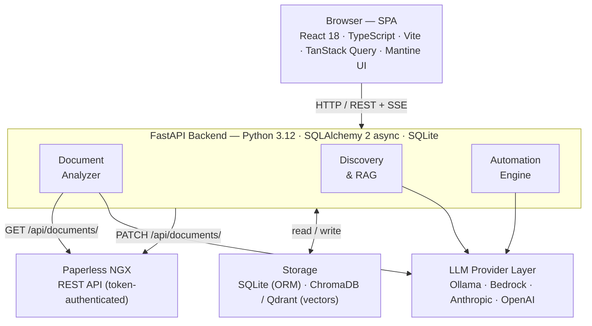
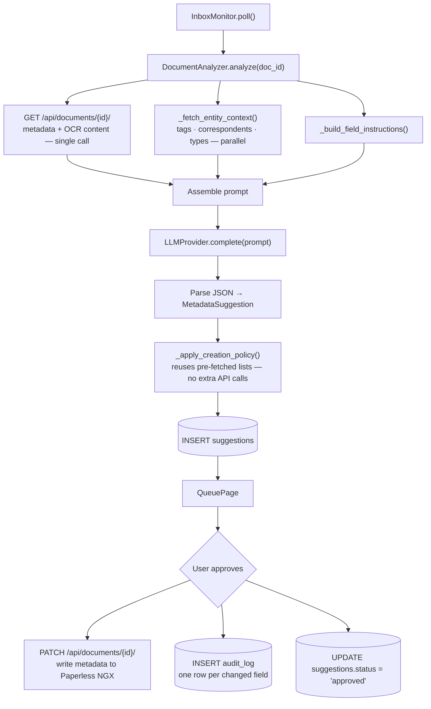
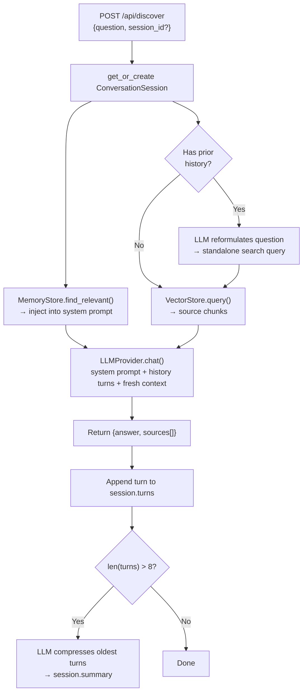
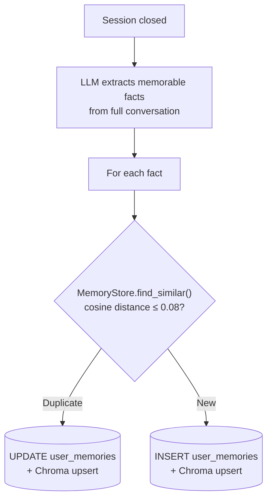

# Paperless IQ — Technical Architecture

> This document is the authoritative reference for the system structure, module responsibilities, and key data flows. Update it when you add, remove, or significantly alter a subsystem.

---

## 1. System Overview



---

## 2. Backend Modules

### `backend/main.py` (~2 200 lines)
The FastAPI application entry-point. Contains:
- All HTTP route handlers (`@app.get/post/put/delete`)
- `lifespan()` — startup/shutdown: DB init, background task launch, settings seed
- `_automation_loop(batch_size=None|N)` — unified background loop (inbox monitor or scheduler)
- `_session_expiry_loop(app)` — hourly background task: extracts memories from sessions older than 24 hours, then deletes them (see D-19)
- `_background_index(doc_id)` — background task to embed a document after it is processed
- `_extract_memories_from_session(session, ...)` — extracts and deduplicates memories; called from explicit session close and from `_session_expiry_loop`
- Helper utilities: `_paperless_list()`, `_apply_settings()`, auth middleware

**Session management rule:**
- HTTP route handlers receive `session: AsyncSession = Depends(get_session)` — the session lifecycle is managed by FastAPI's dependency injection.
- Background tasks and lifespan code use `async with AsyncSessionLocal() as db` — they run outside a request context.
- Never use `AsyncSessionLocal()` inside a route handler and never use `Depends(get_session)` in a background task.

### `backend/analyzer.py` (~590 lines)
`DocumentAnalyzer` — the core intelligence pipeline.

Key responsibilities:
- `analyze(document_id)` — full pipeline: fetch metadata, build prompt, call LLM, parse JSON, apply creation policy, persist suggestion
- `_fetch_entity_context()` → `tuple[str, list[str], list[str], list[str]]` — fetches all tags / correspondents / document types from Paperless NGX in parallel, returns both the formatted prompt string and the raw lists (to avoid duplicate API calls in `_apply_creation_policy`)
- `_build_field_instructions()` — assembles per-field instruction text from `config.field_descriptions`
- `_apply_creation_policy(suggestion, …, all_tags, all_correspondents, all_document_types)` — accepts pre-fetched entity lists as keyword args to skip redundant API calls; falls back to fetching individually if not provided

**OCR vs full-document mode:**
OCR text is already included in the Paperless NGX `GET /api/documents/{id}/` metadata response (`content` field). The analyzer reuses `doc_meta["content"]` directly — it does **not** make a second `GET /api/documents/{id}/content/` call.

### `backend/providers/`
Four provider adapters that all implement `protocols.LLMProvider`:

| Module | Provider | Notes |
|--------|----------|-------|
| `ollama_provider.py` | Ollama | Single `AsyncClient` instance (singleton per provider object); request queue via `ollama_queue.py` |
| `bedrock.py` | Amazon Bedrock | Lazy boto3 runtime client; cached until `ExpiredTokenException`, then invalidated + retried once |
| `anthropic_provider.py` | Anthropic | Thin wrapper around `anthropic.AsyncAnthropic` |
| `openai_provider.py` | OpenAI | Thin wrapper around `openai.AsyncOpenAI` |

All blocking (boto3) calls use `loop.run_in_executor(None, fn)` with `asyncio.get_running_loop()`.

### `backend/protocols.py`
`LLMProvider`, `VectorStore`, and `Reranker` as `typing.Protocol` (structural subtyping). Implementations are not required to inherit from these — they just need to match the method signatures. This keeps the adapters decoupled.

### `backend/vector_store.py`
Three `VectorStore` implementations plus shared module-level helpers:

| Class | Backend | Notes |
|-------|---------|-------|
| `ChromaVectorStore` | ChromaDB (local disk, `/data/chroma`) | Default; HNSW configurable via `configuration=` API |
| `QdrantVectorStore` | Qdrant (self-hosted or Qdrant Cloud) | Async client (D-06); lazy collection bootstrap; `location=":memory:"` for tests |
| `BedrockKnowledgeBaseStore` | Amazon Bedrock Knowledge Base | Delegates embedding storage to managed KB; read-only query |

Shared helpers (used by all backends): `_build_embed_prefix`, `_build_base_meta`, `_maybe_rerank`, `_assemble_doc_results`, `_assemble_chunk_results`.

Chunking is handled by `_chunk` → `_chunk_text` (char windows) or `_chunk_text_sentences` (sentence-aware packing).

`dump_points`/`load_points` on each store enables backend-agnostic migration without re-embedding.

### `backend/vector_factory.py`
`make_vector_store(config, embed_provider, concurrency, providers)` — single construction point for all three backends. Wires search-tuning knobs (overfetch, min-score, chunking, HNSW, reranker) consistently. Never construct a store class directly in `main.py` (see D-20).

### `backend/rerankers.py`
`Reranker` implementations wired into the shared query post-processing path:
- `LLMReranker` — listwise prompt to the configured chat provider; no new deps
- `LocalCrossEncoderReranker` — sentence-transformers cross-encoder; **optional** dep (`pip install 'paperless-iq[rerank-local]'`); torch imported lazily on first call
- `BedrockReranker` — Bedrock Rerank API; reuses existing Bedrock credentials

`build_reranker(config, providers)` factory; ships disabled (`rerank_enabled=False`).

### `backend/vector_migrate.py`
`migrate_embeddings(src, dst)` / `migrate_memories(src, dst)` — copies stored vectors from one backend to another without re-embedding. Used by the settings-reload auto-migration and by `POST /api/vector/migrate`.

### `backend/memory_store.py`
`MemoryStore` base (shared `find_similar` + `SIMILARITY_THRESHOLD = 0.88`). Two backends:
- `ChromaMemoryStore` — default, co-located with the document store on disk
- `QdrantMemoryStore` — uses the same Qdrant client as `QdrantVectorStore`

`make_memory_store(config, provider)` factory selects the backend matching `vector_store_backend`.

### `backend/orm_models.py`
SQLAlchemy 2 ORM declarations. Seven tables:

| Table | Purpose |
|-------|---------|
| `suggestions` | Pending / approved / rejected metadata suggestions |
| `audit_log` | Field-level change history |
| `document_tracking` | Documents seen by the inbox monitor (first seen, last analyzed, embedding status) |
| `settings` | Single-row JSON blob for `PaperlessIQConfig` |
| `conversation_sessions` | Discovery chat sessions (verbatim turns + rolling summary) |
| `user_memories` | Long-term memory facts |
| `user_permissions` | Per-user access-control flags; created/updated at every login |

### `backend/models.py`
Pydantic v2 models. Separate from ORM models — the API serialises Pydantic, persistence uses ORM. Mapping is explicit (`from_attributes=True`).

### `backend/settings_service.py`
Loads `PaperlessIQConfig` from the database; falls back to `PIQ_*` env vars on first run. After the first UI save the database value is canonical. Credentials are Fernet-encrypted before storage (via `providers/encryption.py` + `SECRET_KEY`).

### `backend/approval_queue.py` / `backend/inbox_monitor.py`
`ApprovalQueue` — methods to list, approve, reject, and bulk-action suggestions, handling entity creation when `allow_new` policies are active.
`InboxMonitor` — fetches documents tagged with the inbox tag that haven't been seen before.

---

## 3. Frontend Structure

```
frontend/src/
├── api.ts                   # All API calls (single module, typed return values)
├── i18n.ts                  # react-i18next init (LanguageDetector → localStorage "piq_lang")
├── locales/{en,de,fr,es,it}/translation.json  # Translation resources (single namespace)
├── App.tsx                  # Router, layout, nav sidebar; fetches + applies permissions
├── ThemeProvider.tsx        # MantineProvider + createTheme driven by /api/theme settings
├── PermissionsContext.tsx   # React context + usePermissions() hook
├── main.tsx                 # React root
│
├── components/
│   └── MarkdownText.tsx      # renderInline + MarkdownText component + Source type
│                             # Used by DiscoveryPage for LLM answer rendering
│
├── pages/
│   ├── LoginPage.tsx
│   ├── ManualPage.tsx        # On-demand document analysis
│   ├── QueuePage.tsx         # Approval queue
│   ├── ProcessingPage.tsx    # Status panel (monitoring only — no maintenance actions)
│   ├── AuditPage.tsx
│   ├── DiscoveryPage.tsx     # RAG chat interface
│   ├── SettingsPage.tsx      # ~510-line orchestrator — all state + handleSubmit
│   └── settings/
│       ├── constants.ts      # METADATA_FIELDS · LLM_MODEL_DEFAULTS · EMBED_MODEL_DEFAULTS
│       ├── ConnectionTab.tsx
│       ├── AIProviderTab.tsx
│       ├── PromptsFieldsTab.tsx
│       ├── MetadataRulesTab.tsx
│       ├── AutomationTab.tsx
│       ├── AppearanceTab.tsx
│       ├── MemoriesTab.tsx
│       └── AccessControlTab.tsx  # User permissions table + maintenance actions (reindex, reset)
│
├── AutocompleteInput.tsx     # Reusable tag autocomplete
├── CfNameEditor.tsx          # Custom field name inline editor
├── StatusPanel.tsx           # Background task status widget
└── TagInput.tsx              # Tag chip input
```

### SettingsPage pattern (orchestrator + tab components)

`SettingsPage.tsx` owns **all** state, effects, mutations, and the `handleSubmit` form handler. It renders the active tab component as a pure display tree, passing values and setters as props.

Tab components (`settings/*.tsx`):
- Are **pure display** — no `useQuery`, no `useMutation`, no API calls. Exceptions:
  - `MemoriesTab` owns its fire-and-forget memory CRUD (lifting would require 4+ extra callback props for trivial state)
  - `AccessControlTab` owns its `/api/piq-users` CRUD and maintenance action calls (same reasoning; these don't feed into `handleSubmit`)
- Receive props via explicit TypeScript `interface Props`
- **Never** define constants that are also needed by `SettingsPage` — put shared constants in `constants.ts`

### State management
- TanStack Query for server state (settings, tags, custom fields, logos)
- `useState` for all form/UI state that needs to survive tab switches (the form is a single `<form>` element wrapping all 8 tab views; switching tabs shows/hides — not unmounts — the content)
- `PermissionsContext` provides the current user's effective permissions to all pages; populated from `GET /api/piq-users/me` after login
- No Redux or Zustand — the query cache + local component state is sufficient

### Internationalisation (react-i18next)
- `i18n.ts` initialises **react-i18next** with `i18next-browser-languagedetector`. Resources are the per-language JSON files under `locales/<lang>/translation.json` (single `translation` namespace, 5 languages, identical key sets).
- Components consume strings via the `useTranslation()` hook (`const { t } = useTranslation()`) — never a module-level `t` import. Interpolation uses single braces (`t("key", { name })`) via `interpolation: { prefix: "{", suffix: "}" }`.
- Language is **client-side only**: the detector reads/writes localStorage key `piq_lang` (falls back to browser locale, then `en`). There is no backend language field — switching via `i18n.changeLanguage` re-renders live, no reload, no API round-trip.
- Adding a string means adding the key to **all 5** locale files; `npm run check:i18n` (`scripts/check-i18n.mjs`) enforces key parity in CI.

---

## 4. Data Flows

### 4.1 Metadata analysis pipeline



### 4.2 Discovery conversation

**Per-question flow:**



**On session close — memory extraction:**



### 4.3 Settings save (frontend → backend)
The form collects state from all 8 tabs into a single `values` dict:
1. Starts from the current full server settings (`{...s}`) so hidden-tab values are not lost
2. Overlays `FormData` fields present in the active tab's DOM
3. Merges React-state-owned values (theme, prompt text, field descriptions, Bedrock fields) explicitly
4. Sends `PUT /api/settings` with the merged dict

This means every save is a full replacement — the backend receives the complete config, not a patch.

---

## 5. Async Patterns

- All `asyncio.get_event_loop()` calls have been replaced with `asyncio.get_running_loop()`. Do not re-introduce `get_event_loop()`.
- Blocking calls (boto3, heavy crypto) use `await loop.run_in_executor(None, fn)`.
- The Ollama `AsyncClient` is a singleton per `OllamaProvider` instance — never create a new client per request.
- The Bedrock boto3 runtime client is cached on the provider instance and invalidated on `ExpiredTokenException` (with one automatic retry).

---

## 6. Security

### Credentials
- LLM API keys and Bedrock secrets are Fernet-encrypted with `SECRET_KEY` before being stored in SQLite. Plaintext never appears in logs or API responses.
- Bedrock `__KEEP__` sentinel: the frontend sends `"__KEEP__"` for secret sub-fields that weren't changed; the backend retains the existing encrypted value.
- `PAPERLESS_TOKEN` is stored in the environment only (not in the settings DB) and injected at request time.

### Authentication
- Session tokens are HMAC-SHA256 signed (`jti.username_b64.exp.sig`) using the machine key. Valid for 7 days. Revocation is in-memory (cleared on restart).
- Auth is enforced only when `PAPERLESS_URL` is set. Without it the app runs in open/dev mode.
- Login is rate-limited to 10 attempts per IP per 5-minute window (in-memory, resets on restart).
- `POST /api/auth/login` validates credentials against Paperless NGX (`/api/token/`), checks admin status, upserts the `user_permissions` row, and issues the session token.
- Public paths exempt from auth: `/api/auth/*`, `/api/status`, `/api/theme`, `/api/logos`, `/health`.

### Authorisation
- `require_perm(*perms)` in `main.py` is a FastAPI dependency factory. It checks that the authenticated user has **any** of the listed permission flags in their `user_permissions` row.
- `sync_ng_admins=True` (default): Paperless NGX superusers/staff are auto-granted full PIQ access on login without manual permission grants (solves the bootstrap problem).
- The `can_access` base check runs in `auth_middleware` using a fresh `AsyncSessionLocal()` session — it cannot use `Depends(get_session)` because middleware runs outside the request dependency graph.
- All per-route permission checks use `Depends(require_perm(...))` with `Depends(get_session)` — never `AsyncSessionLocal()`.

### Webhook
- `POST /api/webhook/paperless` is intentionally unauthenticated (Paperless NGX calls it without a PIQ session token). Set `WEBHOOK_SECRET` in the environment and configure Paperless NGX to send it as `X-Webhook-Secret` to restrict access.
- CORS origins are restricted via `CORS_ALLOWED_ORIGINS` env var (comma-separated). Defaults to `*` for backwards compatibility.
